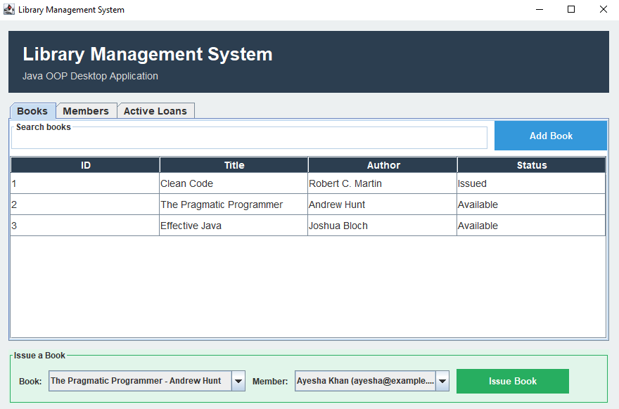
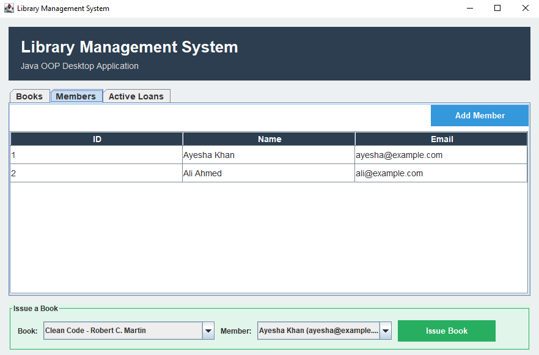
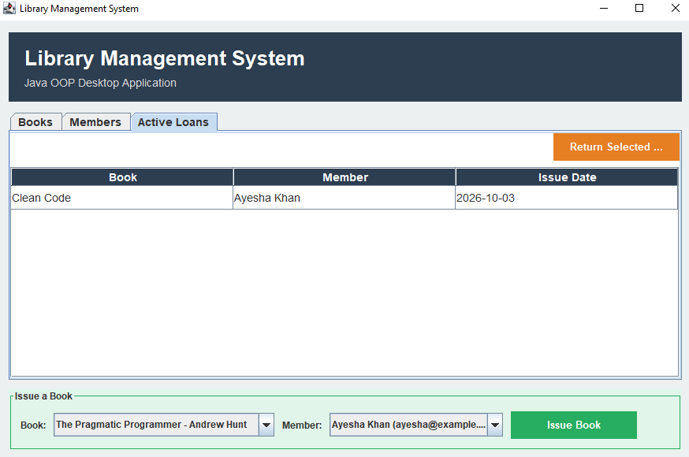

# Library Management System

A Java OOP desktop application for managing books, library members, and book loans through a simple and colorful graphical interface.

## Features

- Add new books
- Search books by title or author
- Add library members
- Issue books to members
- Return issued books
- View active loans
- Check book availability
- Sort table data
- Input validation and error messages
- Colorful Java Swing interface

## Technologies Used

- Java
- Java Swing
- Object-Oriented Programming (OOP)
- Java Collections
- Java LocalDate

## OOP Concepts

This project demonstrates:

- Classes and Objects
- Encapsulation
- Constructors
- Methods
- Object relationships
- Collections
- Exception handling

## Project Structure

Library-Management-System/
├── Main.java
├── Book.java
├── Member.java
├── Loan.java
├── LibraryService.java
├── LibraryFrame.java
├── README.md
└── screenshots/
    ├── main.PNG
    ├── members.PNG
    └── loans.PNG

## Screenshots

### Main Screen

### Members

### Active Loans

## How to Run

Make sure Java JDK 17 or newer is installed.

Check Java:

java -version

Check the compiler:

javac -version

Compile the project:

javac *.java

Run the application:

java Main

## Main Classes

Main.java - Starts the application.

Book.java - Stores book ID, title, author, and availability.

Member.java - Stores member ID, name, and email.

Loan.java - Handles book issue and return information.

LibraryService.java - Manages books, members, loans, searching, issuing, and returning.

LibraryFrame.java - Provides the graphical user interface using Java Swing.

## Purpose

This project was created to practice Java Object-Oriented Programming, Java Swing, collections, and desktop application development.

## Author

Rameen Saqib

GitHub: https://github.com/rameensaqib02-debug

## License

This project is created for educational and portfolio purposes.
